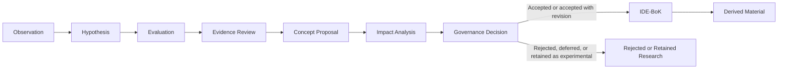
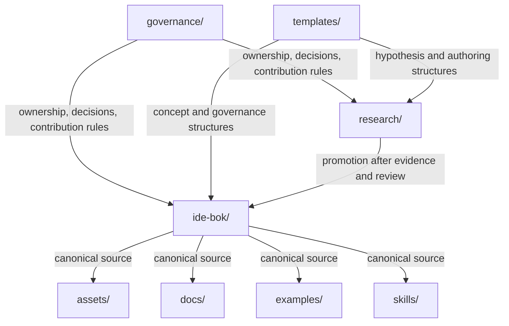
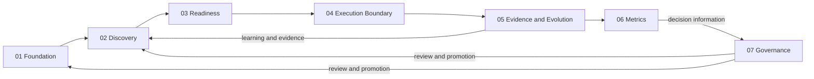

# Repository Architecture Map

**Scope:** Current repository structure

**Last reviewed:** 2026-07-28

## Purpose

This document describes the repository as it exists today: the purpose of each
directory, its knowledge dependencies, the roles responsible for it, and its
relationship to the IDE-BoK knowledge lifecycle.

The dependencies described here are knowledge and governance dependencies. The
repository currently contains documentation and supporting assets, not a
software build or package dependency graph.

Ownership refers to the roles defined in
[`governance/ownership-model.md`](../../governance/ownership-model.md). It does
not assign those roles to named individuals. Most current concept files still
declare their owner as `unassigned`.

## Repository lifecycle

The repository defines a progression from experimental knowledge to governed
knowledge and then to derived operational material.

In the current directory model:

- `research/` contains non-canonical observations, hypotheses, experiments,
  comparisons, validation material, and rejected work.
- `governance/` and the governance material inside `ide-bok/` define how
  decisions, review, promotion, ownership, and authoring operate.
- `ide-bok/` contains the governed Body of Knowledge.
- `assets/`, `docs/`, `examples/`, and `skills/` contain material that explains,
  illustrates, or applies IDE-BoK knowledge without redefining it.
- `templates/` supports both knowledge creation and operational application.

There is a current status ambiguity that this map does not attempt to resolve:
the root README describes `ide-bok/` as authoritative, while several concept
files within it have `status: proposed`. Consumers should inspect document
metadata and governance decisions rather than infer canonical status from the
directory alone.

## Directory dependency map

## Top-level directories

| Directory | Current purpose | Direct dependencies | Primary ownership roles | Lifecycle relationship |
|---|---|---|---|---|
| `assets/` | Visual assets, including diagrams, infographics, and reference cards. | Canonical concepts and the visual-first rule in the Constitution. | IDE-BoK Steward, relevant Domain Steward, Reviewer. | Derived operational knowledge. Visuals may simplify but must not redefine concepts. |
| `docs/` | Roadmaps and derived repository documentation. | Repository governance and the IDE-BoK material being documented. | Repository Owner, IDE-BoK Steward, Reviewer. | Derived documentation and planning; not an independent source of canonical definitions. |
| `examples/` | Illustrative examples and case studies. | Business Change, Source Specification, Readiness, Execution Boundary, evidence, outcomes, and learning. | Relevant Domain Steward and Reviewer. | Operational knowledge. Examples illustrate canonical content but are not normative. |
| `governance/` | Repository ownership, decisions, and contribution governance. | Constitution, authoring rules, and repository operating decisions. | Repository Owner and IDE-BoK Steward. | Controls review and promotion across the lifecycle. |
| `ide-bok/` | The Intent-Driven Engineering Body of Knowledge and its governed cross-cutting architecture. | Constitution, taxonomy, authoring guide, evidence, and governance review. | IDE-BoK Steward, Domain Stewards, and Reviewers. | Destination of promoted knowledge and source for derived material. Document metadata distinguishes proposed content from more mature content. |
| `research/` | Non-canonical research lab for observations, hypotheses, experiments, comparisons, validation, and rejected work. | Research Promotion Process, hypothesis template, evidence, and contributor review. | Research Contributor and Reviewer; IDE-BoK Steward at promotion boundaries. | Entry and evaluation area for experimental knowledge. |
| `skills/` | Candidate AI skills derived from IDE-BoK concepts. | Canonical IDE-BoK definitions and relevant operational templates. | Relevant Domain Steward, IDE-BoK Steward, and Reviewer. | Derived operational application; skills do not become independent sources of truth. |
| `templates/` | Reusable structures for concepts, hypotheses, ADRs, metrics, business changes, specifications, and readiness assessments. | Constitution, Authoring Guide, concept model, and relevant domain concepts. | IDE-BoK Steward and relevant Domain Stewards. | Operational knowledge supporting research, governance, authoring, and application. |

## `assets/`

The directory currently contains a README and placeholder subdirectories.

| Directory | Purpose | Dependencies | Ownership | Lifecycle relationship |
|---|---|---|---|---|
| `assets/diagrams/` | Future framework and concept diagrams. | The canonical concepts and relationships being depicted. | IDE-BoK Steward and relevant Domain Steward. | Derived visual representation. |
| `assets/infographics/` | Future explanatory infographics. | Canonical concepts and approved terminology. | IDE-BoK Steward, relevant Domain Steward, Reviewer. | Derived explanatory material. |
| `assets/reference-cards/` | Future compact reference material. | Canonical concepts and operational templates. | Relevant Domain Steward and Reviewer. | Derived operational material. |

All three subdirectories currently contain only `.gitkeep` placeholders.

## `docs/`

| Directory | Purpose | Dependencies | Ownership | Lifecycle relationship |
|---|---|---|---|---|
| `docs/architecture/` | Derived architectural navigation and descriptions of the repository and its knowledge organization. | Current repository structure, governance documents, and authoritative IDE-BoK architecture. | Repository Owner, IDE-BoK Steward, Reviewer. | Derived documentation. It describes and links to sources of truth but does not replace them. |
| `docs/architecture/reviews/` | Architecture review reports retained for traceability. | The reviewed architecture, review criteria, and repository governance. | IDE-BoK Steward and Reviewer. | Review evidence. A report may require changes but does not itself redefine the reviewed architecture. |

The existing [`docs/roadmap.md`](../roadmap.md) tracks the planned development
of governance, canonical foundations, pre-execution concepts, post-execution
concepts, and operational material.

## `examples/`

| Directory | Purpose | Dependencies | Ownership | Lifecycle relationship |
|---|---|---|---|---|
| `examples/case-studies/` | Future contextual accounts of applying the IDE-BoK. | Relevant canonical concepts, observed evidence, outcomes, learning, and deviations. | Relevant Domain Steward, Research Contributor, Reviewer. | Operational evidence and illustration; not normative. |
| `examples/worked-examples/` | Future step-by-step examples using IDE-BoK concepts and templates. | Canonical concepts and the applicable templates. | Relevant Domain Steward and Reviewer. | Derived operational guidance. |

Both subdirectories currently contain only `.gitkeep` placeholders.

## `governance/`

This directory contains repository-level governance rather than a new IDE-BoK
knowledge domain.

| Current file | Purpose | Dependencies | Ownership | Lifecycle relationship |
|---|---|---|---|---|
| `ownership-model.md` | Defines Repository Owner, IDE-BoK Steward, Domain Steward, Research Contributor, and Reviewer roles. | Constitution and repository operating needs. | Repository Owner. | Assigns responsibility throughout the lifecycle. |
| `decision-log.md` | Records accepted repository governance decisions. | Governance review and documented decisions. | Repository Owner and IDE-BoK Steward. | Provides traceability for lifecycle and repository changes. |

## `ide-bok/`

The numbered directories are the domains and governance areas currently present
in the IDE-BoK. The unnumbered `architecture/` directory contains cross-cutting
architecture and does not introduce an additional IDE-BoK domain. This map uses
the existing domain names and does not introduce additional domains.

The arrows summarize the responsibilities described by the existing documents;
they are not a substitute for the still-incomplete relationship sections in
individual concept files.

| Directory | Current contents and purpose | Dependencies | Primary ownership roles | Lifecycle relationship |
|---|---|---|---|---|
| `ide-bok/architecture/` | Proposed cross-cutting Engineering Capability architecture. | Constitution, Concept Model, Knowledge Taxonomy, architecture review, and governance decision. | IDE-BoK Steward and Reviewer; Repository Owner for final governance authority. | Governed proposal and sole authoritative location for Engineering Capability architecture. It remains non-canonical until approved and promoted. |
| `ide-bok/00-governance/` | Constitution, Authoring Guide, Knowledge Taxonomy, Concept Model, and Glossary. Protects IDE-BoK identity, structure, terminology, and authoring consistency. | North Star, evidence, governance decisions, and concept relationships. | IDE-BoK Steward and Reviewer; Repository Owner for final authority. | Defines the rules by which knowledge is classified, authored, reviewed, and treated as authoritative. |
| `ide-bok/01-foundation/` | Intent, Context, Transformation, and Evidence. | Constitution and governance rules. The concepts also depend on one another conceptually, although their explicit relationship sections remain incomplete. | IDE-BoK Steward, Foundation Domain Steward, Reviewer. | Foundational knowledge under the current metadata status of each file. |
| `ide-bok/02-discovery/` | Discovery, Business Change, and Source Specification. | Foundation concepts, especially Intent, Context, Transformation, and Evidence. | Discovery Domain Steward and Reviewer. | Core knowledge that turns an initial need into explicit intent and an execution-independent behavioral contract. |
| `ide-bok/03-readiness/` | Readiness. | Discovery outputs, context, constraints, dependencies, validation strategy, and risk control. | Readiness Domain Steward and Reviewer. | Core knowledge used to determine whether execution should begin. |
| `ide-bok/04-execution-boundary/` | Execution Boundary. | Readiness, scope, constraints, permissions, validations, evidence requirements, escalation triggers, and stop conditions. | Execution Boundary Domain Steward and Reviewer. | Core knowledge governing the handoff from preparation to execution. |
| `ide-bok/05-evidence-and-evolution/` | Flow Integrity and Continuous Evolution. | Business Change, Source Specification, execution outcomes, operational evidence, and metrics. | Evidence and Evolution Domain Stewards and Reviewer. | Core knowledge that evaluates preservation of intent and feeds learning back into future transformations. |
| `ide-bok/06-metrics/` | Metrics Model. | Outcomes, quality, flow, execution health, context health, evidence, and decision needs. | Metrics Domain Steward and Reviewer. | Operational measurement guidance supporting evidence and governance decisions. |
| `ide-bok/07-governance/` | Research Promotion Process. | Knowledge Taxonomy, Constitution, evidence review, impact analysis, and governance decisions. | IDE-BoK Steward, Repository Owner, Reviewer. | Defines the transition from research through proposal and governance decision to promotion. |
| `ide-bok/08-patterns/` | Reserved for future patterns; currently only a `.gitkeep` placeholder. | Future validated concepts and repeatable evidence. | Relevant Domain Steward and Reviewer. | Intended operational or core guidance; no current content has entered the lifecycle here. |
| `ide-bok/09-anti-patterns/` | Reserved for future anti-patterns; currently only a `.gitkeep` placeholder. | Future observed failure modes, consequences, and supporting evidence. | Relevant Domain Steward, Research Contributor, Reviewer. | Intended evidence-backed guidance; no current content has entered the lifecycle here. |

## `research/`

Research is explicitly non-canonical. Nothing in this directory changes the
IDE-BoK until it passes the Research Promotion Process.

| Directory | Purpose | Dependencies | Ownership | Lifecycle relationship |
|---|---|---|---|---|
| `research/foundational/` | Holds foundational research about the object, boundary, and conceptual basis of IDE. | Research Promotion Process, hypotheses, evidence, and related foundational concepts. | Research Contributor, IDE-BoK Steward, Reviewer. | Non-canonical foundational research that may inform future concept proposals. |
| `research/observations/` | Records observed problems, outcomes, or failure modes. | Practical observation and enough context to make the observation interpretable. | Research Contributor and Reviewer. | Lifecycle entry point. |
| `research/hypotheses/` | Holds testable explanations or proposals derived from observations. | Observations and the hypothesis template. | Research Contributor and Reviewer. | Experimental knowledge awaiting evaluation. |
| `research/experiments/` | Holds validation approaches and experiment results. | Hypotheses, success and refutation conditions, and observable evidence. | Research Contributor and Reviewer. | Evaluation stage. |
| `research/validated/` | Holds research that has passed its stated validation conditions. | Experiments, supporting and contradicting evidence, and evidence review. | Research Contributor, Reviewer, IDE-BoK Steward at proposal time. | Input to concept proposal, impact analysis, and governance review; not canonical by location alone. |
| `research/rejected/` | Retains rejected or superseded proposals for historical learning. | Governance or research decisions, evidence, reasons, dates, affected concepts, and reconsideration conditions. | Research Contributor and Reviewer. | Terminal or paused experimental state. |
| `research/comparisons/` | Compares IDE with other approaches; currently contains a Scrum comparison. | Accurate descriptions of the compared approach and relevant IDE-BoK concepts. | Research Contributor, relevant Domain Steward, Reviewer. | Experimental or explanatory research; not authoritative IDE-BoK content. |

Except for `research/comparisons/` and `research/foundational/`, the research
subdirectories currently contain only `.gitkeep` placeholders.

## `skills/`

The directory currently contains a README listing candidate skills:

- Discovery Advisor
- Source Specification Reviewer
- Readiness Reviewer
- Metrics Advisor
- IDE-BoK Research Assistant

Skills depend on the canonical concepts they apply. They may operationalize
those concepts, but they must not redefine them or become independent sources
of truth.

## `templates/`

| Current template | Primary dependency | Lifecycle use |
|---|---|---|
| `adr-template.md` | Governance decisions and affected IDE-BoK concepts. | Records material decisions during governance review. |
| `business-change-template.md` | Business Change. | Supports operational expression of why a change is needed. |
| `concept-template.md` | Constitution, Authoring Guide, Concept Model, and Knowledge Taxonomy. | Structures proposed and governed concept content. |
| `hypothesis-template.md` | Observations, evidence, validation, and decision criteria. | Structures experimental research. |
| `metric-template.md` | Metrics Model and evidence. | Structures operational measures and their limitations. |
| `readiness-assessment-template.md` | Readiness and Execution Boundary. | Supports the decision to begin or defer execution. |
| `source-specification-template.md` | Source Specification and Business Change. | Structures execution-independent expected behavior and constraints. |

Template maintenance belongs to the IDE-BoK Steward and the Domain Steward for
the concepts represented by each template. Reviewers protect consistency
between the template and its canonical source.

## Root-level control surface

Root files coordinate the directories without creating another knowledge
domain.

| File | Role in the repository |
|---|---|
| `README.md` | Entry point, North Star, repository model, and directory summary. |
| `VISION.md` | Draft vision structure. It currently contains placeholders except for the North Star. |
| `CONTRIBUTING.md` | Contribution workflow and pull request integrity checklist. |
| `CHANGELOG.md` | Records unreleased repository additions; no release policy is currently defined. |
| `REPOSITORY-MANIFEST.md` | Manually lists the intended repository contents. |
| `LICENSE.md` | Records that no license has been selected and that all rights are currently reserved. |
| `.gitignore` | Excludes local or generated files from version control. |

## Dependency and ownership rules

1. Canonical concept definitions must live in one authoritative concept file.
2. Research may inform the IDE-BoK only through evidence review, concept
   proposal, impact analysis, and governance decision.
3. Derived documentation, visuals, examples, templates, and skills may simplify
   or apply canonical knowledge but must not redefine it.
4. The IDE-BoK Steward protects constitutional, taxonomic, terminological, and
   cross-domain coherence.
5. Domain Stewards maintain their respective existing domains.
6. Research Contributors create and evaluate experimental material.
7. Reviewers assess evidence, clarity, duplication, impact, and constitutional
   alignment.
8. The Repository Owner retains final authority over access, publication,
   licensing, and repository governance.
