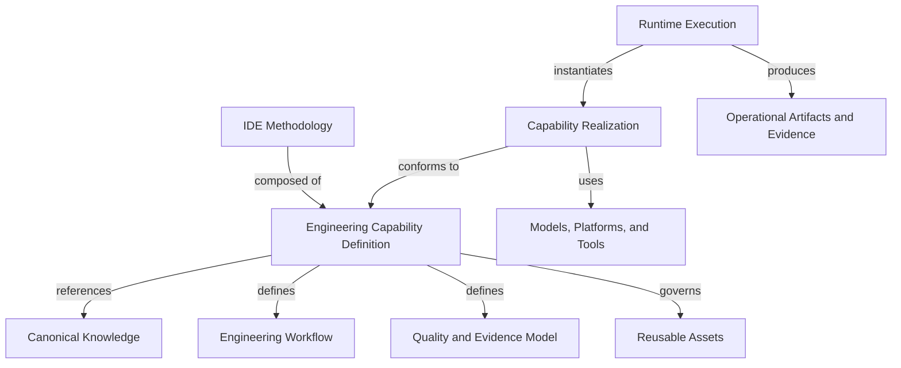

# Architecture Review — Engineering Capability Architecture

**Reviewed document:** `docs/architecture/engineering-capability.md`

**Review date:** 2026-07-28

**Review scope:** Architectural quality, conceptual consistency, practical
usability, AI readability, governance alignment, and long-term maintainability

## 1. Executive Assessment

### Overall status

The document establishes a useful direction but is not ready to become the
canonical architectural reference for Engineering Capabilities.

### Architecture readiness

**REVISE BEFORE APPROVAL**

### Main strengths

- Uses the required concise canonical definition.
- Correctly separates a stable engineering ability from changing technologies.
- Treats knowledge, quality, evidence, and evolution as first-class concerns.
- Makes human, AI, and hybrid participation possible.
- Distinguishes Engineering Capabilities from software, product, and business
  capabilities.
- Provides practical diagrams, lifecycle guidance, and repository intent.
- Explicitly prevents implementations from silently redefining canonical
  knowledge.

### Main risks

- The document declares itself canonical from a directory currently defined as
  derived documentation.
- The architectural hierarchy uses untyped arrows and treats composition,
  realization, dependency, and runtime mode as equivalent parent-child
  relationships.
- The definition lacks a decisive qualification test for determining whether a
  proposed item is an Engineering Capability.
- `Skill`, an explicit future repository concern, is absent from the concept
  boundary model.
- The lifecycle labels knowledge as canonical before research, review, and
  governance approval.
- The future directory model risks duplicating IDE-BoK knowledge and existing
  shared assets.
- Capability dependencies, composition, maturity, and compatibility are not
  modeled.

### Final recommendation

Retain the core intent and most of the practical guidance. Revise the authority
model, relationship model, qualification rules, lifecycle gates, and repository
boundaries before approval. Do not begin Task 1 until all Critical and Major
findings are resolved and the resulting architecture has a recorded governance
decision.

## 2. Findings Summary

| ID | Severity | Section | Finding | Impact | Recommended Action |
|---|---|---|---|---|---|
| F-001 | Critical | Status and Architectural authority | The document claims canonical authority from `docs/`, while current repository governance defines `docs/` as derived and `ide-bok/` as authoritative. | Creates competing sources of truth and invalidates repository navigation rules. | Choose and govern one authority model before approval. |
| F-002 | Critical | Architectural Hierarchy | The hierarchy conflates composition, dependency, realization, support, and runtime execution. | Future capabilities will encode incompatible structures and incorrect ownership relationships. | Replace the hierarchy with typed relationships and separate capability definition, realization, execution, and artifacts. |
| F-003 | Major | Canonical Definition | The definition is directionally clear but does not provide a sufficient qualification test. | Almost any repeatable activity, workflow, or tool-supported task could be mislabeled as a capability. | Add mandatory qualification and exclusion criteria without changing the required definition. |
| F-004 | Major | Relationship with Other Concepts | `Skill` is missing even though it is a planned derived artifact in the repository. | Skills and capabilities are likely to be duplicated or treated as synonyms. | Define Skill and its realization/consumption relationship to capabilities. |
| F-005 | Major | Lifecycle | “Capture Canonical Knowledge” occurs before evidence review and governance approval. | Draft or proposed material may be treated as authoritative prematurely. | Add research, proposal, validation, approval, and promotion gates; reserve “canonical” for approved content. |
| F-006 | Major | Definition and Future Evolution | The capability contract is prose, not a complete normative anatomy. | Humans and AI systems cannot validate capability completeness consistently. | Define required identity, outcome, boundary, inputs, outputs, dependencies, consumers, workflow, quality, evidence, assets, realizations, ownership, and version fields. |
| F-007 | Major | Repository Organization | `knowledge/`, `templates/`, and `examples/` under each capability overlap existing authoritative and shared directories. | Encourages duplication, content drift, broken links, and future migration work. | Distinguish references from owned content and define shared-versus-local placement rules before creating `capabilities/`. |
| F-008 | Major | Separation of Concerns | Methodology, architecture, research, and governance are not represented as distinct responsibilities. Human playbooks are grouped under platform implementations. | The model cannot explain who defines, approves, realizes, executes, or evolves a capability. | Add explicit responsibility boundaries and treat research/governance as controls across the lifecycle. |
| F-009 | Major | Future Evolution | No model exists for capability dependencies, composition, maturity, or compatibility. | Growth will create hidden coupling, circular dependencies, and incompatible versions. | Add minimal relationship and evolution rules before capability creation begins. |
| F-010 | Moderate | Canonical Definition and Quality Model | Scoring models and metrics appear mandatory for every capability without proportionality guidance. | Contributors may invent meaningless scores or metrics to satisfy structure. | Require quality criteria and evidence; make scoring and quantitative metrics conditional on decision value. |
| F-011 | Moderate | Relationship with Other Concepts | Prompt, tool, platform, agent, and workflow are assigned single roles even though their roles vary by context. | The taxonomy will fail for generated prompts, shared tools, workflow engines, or agents that consume multiple capabilities. | Model them with typed relationships such as `realizes`, `uses`, `hosts`, `supports`, and `consumes`. |
| F-012 | Moderate | Whole document | The document lacks machine-readable identity, version, owner, status vocabulary, and typed relationship declarations. | RAG, repository validation, dependency analysis, and AI navigation will depend on prose interpretation. | Add stable metadata and normative field names after governance defines their schema. |
| F-013 | Moderate | Purpose and Quality | The practical delivery measures in the canonical intent—effort, time, cost, quality, and rework—are not reflected in the capability architecture. | Capabilities may optimize artifact completeness without demonstrating delivery value. | Require each capability to state which outcome and performance dimensions it informs, with limitations. |
| F-014 | Minor | Terminology | `Workflow` and `Engineering Workflow`, and `Implementation` and `Platform Implementation`, are used inconsistently. | Search and extraction may treat equivalent terms as different concepts. | Select one canonical label per concept and use it throughout. |
| F-015 | Minor | Structure | Qualification guidance is split between Purpose, Definition, Lifecycle, and Future Evolution. | Contributors must infer the creation decision from multiple sections. | Consolidate decision guidance near the definition. |

## 3. Detailed Findings

### F-001 — Canonical authority conflicts with repository governance

**Severity:** Critical

**Affected section:** Status and Architectural authority

**Current problem**

The document declares `Status: Canonical architectural reference` and states
that it is the source of truth for all Engineering Capabilities. Current
repository documents state that:

- `ide-bok/` contains authoritative knowledge;
- `docs/` contains roadmap and derived documentation;
- derived material must not redefine canonical concepts;
- every concept has one authoritative definition.

No governance decision currently creates an exception for architecture
documents.

**Why it matters**

Future contributors and AI systems cannot determine whether to trust the
architecture document, the IDE-BoK, or the repository map. This is a direct
single-source-of-truth violation.

**Recommended correction**

Choose one of two explicit models:

1. Make `docs/architecture/` an approved authoritative location for
   repository-level architecture and update the README, Repository Map,
   manifest, and governance decision log; or
2. Place the canonical Engineering Capability concept in the IDE-BoK and keep
   this document as its derived architectural view.

Do not label the document canonical until the selected model is approved.

**Suggested wording**

Until the governance decision is recorded:

> **Status:** Proposed architectural reference

### F-002 — The hierarchy conflates different relationship types

**Severity:** Critical

**Affected section:** Architectural Hierarchy

**Current problem**

Every diagram edge uses the same unlabeled arrow. The model therefore implies
that:

- knowledge, workflows, metrics, examples, and implementations are equivalent
  child elements;
- AI Agent, Human Practice, and Hybrid Execution are equivalent implementation
  types;
- prompts, LLMs, tools, and platforms are children owned by an agent;
- runtime execution is outside the main hierarchy.

These are different relationships. A prompt may be a reusable asset, generated
runtime artifact, or implementation component. A platform hosts an
implementation. A tool supports an execution. Human and hybrid describe
realization or execution modes, not necessarily platform implementations.

**Why it matters**

The hierarchy will be copied into every capability. Untyped or false
relationships will become structural coupling and make dependency extraction
unreliable.

**Recommended correction**

Separate four architectural objects:

1. **Capability definition** — outcome, boundary, contract, workflow, quality,
   and evidence requirements.
2. **Reusable assets** — templates, rubrics, examples, and guidance.
3. **Realizations** — human, AI, or hybrid operationalizations conforming to the
   capability.
4. **Runtime executions** — contextual instances producing operational
   artifacts and evidence.

External technologies should be dependencies of a realization, not children of
an agent.

**Suggested structural change**

Use labeled edges:

This is a correction to relationship semantics, not a new IDE domain.

### F-003 — The definition does not decide what qualifies

**Severity:** Major

**Affected section:** Canonical Definition

**Current problem**

“Repeatable engineering ability” and “specific outcome” are both broad. A
meeting, script, checklist, workflow step, deployment tool, or software feature
could satisfy the words without satisfying the intended architecture.

**Why it matters**

Contributors need a deterministic creation decision. AI systems need explicit
criteria instead of relying on semantic similarity.

**Recommended correction**

Keep the required definition, then add a qualification rule. A proposed
capability should qualify only when it:

- addresses a distinct recurring engineering problem;
- produces an identifiable engineering outcome;
- has explicit inputs, outputs, boundary, and consumers;
- requires coherent knowledge and decision rules;
- can define quality and required evidence;
- can support more than one conforming realization;
- remains meaningful if a tool, platform, model, or prompt is replaced;
- is larger than a single activity but reusable across broader processes.

Add non-qualifiers: documents, templates, prompts, tools, isolated activities,
software features, and organization-specific procedures do not become
capabilities merely because they are reusable.

### F-004 — Skill has no boundary

**Severity:** Major

**Affected section:** Relationship with Other Concepts

**Current problem**

The relationship table omits Skill. The repository already describes candidate
skills as applications of canonical knowledge that must not become independent
sources of truth.

**Why it matters**

Future work can easily create one Skill and one Engineering Capability with the
same name and duplicated content.

**Recommended correction**

Add a concise boundary such as:

> A Skill is a reusable operational package that enables a particular human or
> AI executor to apply one or more Engineering Capabilities in a defined
> environment. A Skill consumes capability knowledge and may provide a
> realization; it does not define the capability.

Confirm this wording through governance before treating it as canonical.

### F-005 — The lifecycle promotes knowledge too early

**Severity:** Major

**Affected section:** Lifecycle of an Engineering Capability

**Current problem**

The lifecycle moves from design directly to “Capture Canonical Knowledge.”
Research, evidence review, concept proposal, impact analysis, governance
decision, and promotion are absent from the main flow. Governance appears only
at the final evolution step.

**Why it matters**

This contradicts the current research promotion process and allows unvalidated
knowledge to receive canonical status.

**Recommended correction**

Use status-accurate stages:

1. Identify problem and collect evidence.
2. Propose capability.
3. Define candidate knowledge, workflow, and quality model.
4. Validate with examples or experiments.
5. Perform dependency and impact review.
6. Make governance decision.
7. Promote approved definition.
8. Create conforming realizations.
9. Collect operational evidence.
10. Evolve through the same governed cycle.

### F-006 — The capability contract lacks a normative anatomy

**Severity:** Major

**Affected section:** Canonical Definition and Future Evolution

**Current problem**

Required elements are scattered through prose. The document does not define
which fields are mandatory, optional, unique, or machine-readable.

**Why it matters**

Two contributors can create structurally different capabilities while both
claiming conformance. Automated validation cannot distinguish complete from
incomplete definitions.

**Recommended correction**

Add a normative “Capability Contract” section containing at least:

- stable identifier and name;
- version, status, owner, and review date;
- problem and intended outcome;
- scope and explicit exclusions;
- inputs and outputs;
- dependencies and consumers;
- canonical knowledge references;
- implementation-independent workflow;
- decision, validation, escalation, and stop conditions;
- quality criteria and required evidence;
- reusable assets;
- supported realization types;
- metrics when decision-relevant;
- examples and known failure modes;
- change history.

### F-007 — The future layout invites duplication

**Severity:** Major

**Affected section:** Repository Organization

**Current problem**

The proposed `knowledge/`, `templates/`, and `examples/` directories overlap
with `ide-bok/`, `templates/`, and `examples/`. “Governed capability-specific
knowledge derived from the IDE-BoK” does not state whether content is copied,
linked, or owned.

**Why it matters**

Copies will drift. Shared assets may be duplicated across capabilities.
Canonical location and version ownership will become ambiguous.

**Recommended correction**

Before creating `capabilities/`, define:

- whether capability knowledge is referenced or owned;
- when an asset is shared at repository level versus local to one capability;
- how links and versions are validated;
- where cross-capability examples live;
- whether implementations are in the same repository;
- how generated or runtime artifacts are excluded.

Prefer references to canonical IDE-BoK files. Local knowledge should exist only
when the capability uniquely owns it and governance explicitly permits that
ownership.

### F-008 — Separation of concerns omits governing layers

**Severity:** Major

**Affected section:** Separation of Concerns

**Current problem**

The layer table begins with Canonical Knowledge and ends with Runtime Execution.
It does not position IDE methodology, capability architecture, research, or
governance. It also lists a human playbook as a Platform Implementation.

**Why it matters**

The architecture cannot answer who defines rules, who validates hypotheses, who
approves changes, or whether human execution requires a platform.

**Recommended correction**

Clarify:

- IDE Methodology defines the overall system of engineering capabilities.
- Capability Architecture defines the common structural rules.
- Canonical Capability Definition specifies one capability.
- Research supplies non-canonical evidence and hypotheses.
- Governance approves and evolves canonical content.
- Reusable Assets support realizations.
- Realizations operationalize a capability for humans, AI, or both.
- Runtime Executions instantiate a realization.
- Operational Artifacts and Evidence record one execution.

Research and governance should be modeled as cross-cutting lifecycle controls,
not implementation layers.

### F-009 — Growth relationships are missing

**Severity:** Major

**Affected section:** Future Evolution

**Current problem**

The document mentions dependencies but does not define capability-to-capability
relationships, composition, maturity, or compatibility.

**Why it matters**

As capabilities grow, contributors may create circular dependencies, duplicate
abilities, breaking changes, or nested capabilities with unclear ownership.

**Recommended correction**

Define a minimal model before Task 1:

- capabilities may `depend-on`, `produce-for`, `validate`, `constrain`, or
  `compose-with` other capabilities;
- composition must not duplicate semantic ownership;
- dependency cycles require explicit governance review;
- capability versions and realization versions are independent;
- status and maturity are distinct from version;
- breaking changes require dependent-impact review.

Reuse existing IDE-BoK relationship terms where possible rather than creating a
parallel vocabulary.

### F-010 — Scoring and metrics are over-prescribed

**Severity:** Moderate

**Affected section:** Canonical Definition, Architectural Hierarchy, and Quality
Model

**Current problem**

The architecture presents scoring and metrics as standard components of every
capability. Some outcomes are better governed by qualitative criteria and
evidence.

**Why it matters**

Mandatory scoring can create false precision and gaming, contrary to the
current Metrics Model.

**Recommended correction**

Require a quality and evidence model. Require scoring or quantitative metrics
only when they improve a stated decision. Every metric must include purpose,
interpretation, limitations, gaming risks, and unsafe conclusions.

### F-011 — Implementation concepts have context-dependent roles

**Severity:** Moderate

**Affected section:** Relationship with Other Concepts

**Current problem**

Prompt is always called an implementation asset, Tool an implementation
dependency, Platform a provider, and Agent an implementation. In practice, an
agent may consume several capabilities, a prompt may be generated at runtime,
and a workflow engine may host a realization.

**Why it matters**

Single-role definitions become false when reused across platforms or execution
models.

**Recommended correction**

Keep definitions stable but type each relationship independently:

- a realization `conforms-to` a capability;
- an agent or skill may `realize` or `consume` a capability;
- a platform may `host` a realization;
- a tool may `support` an activity or execution;
- a prompt may be `used-by` a realization or `produced-by` an execution;
- a workflow `defines` ordered capability behavior.

### F-012 — AI readability depends on prose inference

**Severity:** Moderate

**Affected section:** Whole document

**Current problem**

The document has no stable ID, version, owner, review date, normative metadata
schema, or typed relationship declarations.

**Why it matters**

Retrieval can find the document, but automated extraction and consistency
validation must infer semantics from prose and unlabeled diagrams.

**Recommended correction**

After resolving canonical authority, add governed front matter and use the same
field names across capability definitions. Give diagrams labeled edges and
repeat critical rules in explicit normative lists rather than relying on
surrounding paragraphs.

### F-013 — Practical delivery measures are disconnected

**Severity:** Moderate

**Affected section:** Purpose, Quality Model, and Future Evolution

**Current problem**

The architecture emphasizes outcome quality and evidence but does not connect a
capability to practical delivery measures such as effort, elapsed time, cost,
quality, and rework.

**Why it matters**

Capabilities could become documentation structures without demonstrating
whether they improve software delivery.

**Recommended correction**

Require each capability to identify:

- the delivery outcome or decision it improves;
- which measurement families are relevant;
- which measures are deliberately excluded;
- how evidence will reveal quality problems or rework;
- why the selected measures are safe to use.

Do not require every capability to optimize every measure.

### F-014 — Canonical labels are inconsistent

**Severity:** Minor

**Affected section:** Relationship table, diagrams, and Separation of Concerns

**Current problem**

The document alternates between `Workflow` and `Engineering Workflow`, and
between `Implementation`, `Platform Implementation`, and human/AI/hybrid
implementation.

**Why it matters**

Search, extraction, and future templates may create duplicate fields.

**Recommended correction**

Adopt `Engineering Workflow`, `Capability Realization`, and `Runtime Execution`
as distinct labels, subject to governance approval, and use each consistently.

### F-015 — Creation guidance is fragmented

**Severity:** Minor

**Affected section:** Purpose, Definition, Lifecycle, and Future Evolution

**Current problem**

The answer to “When should a new capability be created?” is distributed across
four sections.

**Why it matters**

Contributors can miss important criteria or treat the future-evolution list as
optional.

**Recommended correction**

Place a concise “Qualification and Creation Decision” section immediately after
the canonical definition. Reference it from the lifecycle and future-evolution
sections.

## 4. Conceptual Consistency Matrix

| Concept | Canonical Definition Present? | Boundary Clear? | Relationship Clear? | Action Needed |
|---|---|---|---|---|
| Engineering Capability | Yes | Partial | Partial | Add qualification criteria and normative anatomy. |
| Workflow | Yes | Partial | Partial | Distinguish workflow definition from workflow engine and runtime execution. |
| Process | Yes | Partial | Partial | State cardinality and whether processes consume or compose capabilities. |
| Activity | Yes | Mostly | Mostly | Add its place in the typed workflow relationship model. |
| Agent | Yes | Partial | No | Replace “is an implementation” with contextual `realizes` or `consumes` relationships. |
| Skill | No | No | No | Add a definition aligned with `skills/README.md`. |
| Prompt | Yes | Partial | No | Allow reusable, implementation, and runtime roles through typed relationships. |
| Template | Yes | Mostly | Mostly | Clarify shared versus capability-local ownership. |
| Tool | Yes | Mostly | Partial | Model support/use rather than ownership. |
| AI Platform | Yes | Mostly | Partial | Model hosting and runtime services explicitly. |
| LLM | Yes | Mostly | Partial | Treat as an optional realization dependency, not an agent child. |
| Software Feature | Yes | Yes | Mostly | State that it may consume outputs from several capabilities. |
| Business Capability | Yes | Mostly | Partial | Preserve separation and avoid implying all business capabilities require software. |
| Product Capability | Yes | Mostly | Partial | Clarify that product capabilities are outcomes enabled by products, not engineering methods. |
| Canonical Knowledge | Partial | Partial | Partial | Define authority, ownership, and reference rules. |
| Implementation | Partial | No | No | Replace overloaded term with a defined capability-realization model. |
| Runtime Execution | Partial | Partial | Partial | Make it an explicit instance that produces artifacts and evidence. |

## 5. Architecture Decision Review

| Decision | Benefit | Risk | Recommendation | Disposition |
|---|---|---|---|---|
| Organize IDE around reusable engineering abilities. | Keeps the methodology outcome-oriented and actionable. | “Ability” remains too broad without qualification rules. | Retain and add a qualification test. | **Refine** |
| Keep capability definitions technology independent. | Protects durability and portability. | Can become abstract if no operational contract exists. | Retain with mandatory inputs, outputs, workflow, quality, and evidence. | **Keep** |
| Separate canonical knowledge from implementations. | Prevents tools from redefining methodology. | Current ownership and location rules are ambiguous. | Retain and define reference/ownership rules. | **Refine** |
| Include workflow and quality in the capability definition. | Makes capabilities repeatable and evaluable. | Workflow and scoring may be over-prescribed or confused with execution. | Keep workflow and quality; make scoring conditional. | **Refine** |
| Treat agents as capability implementations. | Supports AI operationalization. | An agent may realize part of one capability or consume several capabilities. | Use typed `realizes` and `consumes` relationships. | **Refine** |
| Treat prompts, LLMs, tools, and platforms as agent children. | Produces a visually simple diagram. | Encodes false ownership and dependency semantics. | Replace with dependencies of a realization or execution. | **Remove** |
| Support human, AI, and hybrid execution. | Matches the practical AI-native goal without excluding human responsibility. | Current diagram mixes realization types with runtime modes. | Preserve intent and clarify the model. | **Refine** |
| Store future capabilities under `capabilities/`. | Creates a discoverable aggregation point. | Overlaps existing canonical and shared directories. | Keep only after placement and ownership rules are approved. | **Refine** |
| Feed operational evidence back into canonical knowledge. | Enables continuous evolution. | Current lifecycle skips research and promotion gates. | Retain and route feedback through existing governance. | **Refine** |
| Require a future canonical capability template. | Enables consistency and validation. | Template work could freeze unresolved architecture. | Create only after this review is resolved and approved. | **Keep, deferred** |

## 6. Proposed Corrections

### Required before approval

1. Resolve canonical authority and repository location through a recorded
   governance decision.
2. Replace the untyped hierarchy with a model that separates definition,
   reusable assets, realization, runtime execution, and produced evidence.
3. Add qualification and non-qualification criteria.
4. Add the missing Skill boundary.
5. Align the capability lifecycle with research, evidence review, governance
   decision, and promotion.
6. Define the normative capability contract/anatomy.
7. Resolve shared versus capability-local knowledge, templates, examples, and
   implementations.
8. Add capability dependency, composition, version, status, maturity, and
   compatibility rules at the minimum level needed for Task 1.
9. Separate methodology, architecture, research, governance, realization, and
   runtime responsibilities.
10. Change the document status from canonical until the corrections pass review
    and governance approval.

### Recommended after approval

1. Add governed machine-readable metadata.
2. Add automated checks for identifiers, required fields, links, and typed
   relationships.
3. Define maturity assessment only after real capability evidence exists.
4. Add a visual showing a process consuming multiple capabilities.
5. Establish rules for shared assets and cross-capability examples.
6. Define realization conformance tests.
7. Connect capability metrics explicitly to the existing Metrics Model.
8. Update the Repository Map, README, and manifest after the authority decision.

## 7. Suggested Revised Outline

The current outline has meaningful ordering gaps. Use:

1. **Document Status and Architectural Authority**
2. **Purpose and Scope**
3. **Canonical Definition**
4. **Qualification and Non-Qualification Rules**
5. **Normative Capability Contract**
6. **Relationship to IDE Methodology and IDE-BoK**
7. **Adjacent Concept Boundaries**
   - Process, workflow, and activity
   - Skill, agent, prompt, model, tool, and platform
   - Software, product, and business capabilities
8. **Typed Architecture Model**
   - Capability definition
   - Reusable assets
   - Realizations
   - Runtime executions
   - Operational artifacts and evidence
9. **Research and Governance Boundaries**
10. **Capability Lifecycle and Maturity**
11. **Dependencies, Composition, and Versioning**
12. **Repository Representation**
13. **Design Principles**
14. **Evolution and Change Control**

This ordering puts the creation decision and normative contract before diagrams,
repository layout, and implementation concerns.

## 8. Final Verdict

### Readiness decision

**REVISE BEFORE APPROVAL**

### Findings by severity

- Critical: 2
- Major: 7
- Moderate: 4
- Minor: 2
- Total: 15

### May Task 1 safely begin?

**No.**

Task 1 would encode the unresolved authority, hierarchy, lifecycle, and
repository-placement problems into the canonical Engineering Capability
Template or the first capability. That would multiply correction costs.

### Conditions before proceeding

Task 1 may begin only after:

1. F-001 and F-002 are resolved.
2. F-003 through F-009 are resolved.
3. The revised diagrams use explicit relationship semantics.
4. The revised lifecycle aligns with the existing research promotion process.
5. Skill and realization boundaries are explicit.
6. Repository placement and single-source rules are approved.
7. The revised document receives governance review and a recorded decision.
8. The document status is changed to canonical only after that approval.
