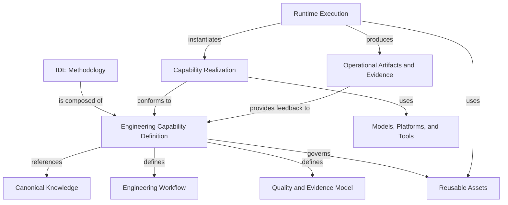
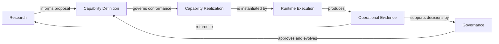

# Engineering Capability Architecture

## 1. Document Status and Architectural Authority

This document is the sole governed source for the proposed architecture of
Engineering Capabilities in Intent-Driven Engineering (IDE).

**Current status:** Proposed

**Authoritative location:** `ide-bok/architecture/engineering-capability.md`

The status `proposed` means that this architecture is complete enough for
review, but it is not yet canonical. It must not be represented as approved
methodology knowledge.

Promotion to `canonical` requires:

1. resolution of the required architecture review findings;
2. confirmation that repository references preserve a single source of truth;
3. review of dependencies and affected documents;
4. an explicit governance decision approving the architecture;
5. publication of the approved status and version in this file.

Documents outside `ide-bok/` may summarize or navigate to this architecture.
They must not duplicate or redefine it.

## 2. Purpose and Scope

Engineering Capabilities are reusable methodology components that make IDE
practical and repeatable when humans and AI share software delivery work.

This architecture defines:

- what qualifies as an Engineering Capability;
- the minimum contract every capability must satisfy;
- the boundary between a capability and adjacent concepts;
- how capabilities relate to knowledge, realizations, and runtime execution;
- how capabilities are proposed, approved, operated, and evolved;
- the repository rules future capability work must follow.

This architecture does not:

- define a specific Engineering Capability;
- create the future `capabilities/` directory;
- define the Engineering Capability Template;
- prescribe a model, platform, tool, prompt, or implementation approach;
- add an IDE-BoK domain.

An Engineering Capability is a cross-domain architectural component. It may
reference concepts from one or more existing IDE-BoK domains without changing
their semantic ownership.

## 3. Canonical Definition

> An Engineering Capability is a repeatable engineering ability that enables software teams to achieve a specific outcome within the Intent-Driven Engineering methodology.

### Practical interpretation

An Engineering Capability connects an identifiable engineering problem to a
repeatable outcome. It defines the knowledge, workflow, decisions, quality
criteria, and evidence required to achieve that outcome while allowing
different conforming realizations.

The capability remains meaningful when an executor, model, platform, prompt, or
tool changes. Technology may realize or support the capability; technology does
not define the capability.

### Qualification rules

A proposal qualifies as an Engineering Capability only when all of the
following are true:

- it addresses a distinct, recurring engineering problem;
- it produces an identifiable engineering outcome;
- it has explicit inputs, outputs, boundaries, and consumers;
- it requires coherent knowledge and decision rules;
- it defines quality criteria and required evidence;
- it supports more than one possible Capability Realization;
- it remains meaningful when a tool, platform, model, or prompt is replaced;
- it is larger than a single isolated Engineering Activity while remaining
  reusable across broader Engineering Processes.

Failure to meet one criterion means the proposal is not ready to become an
Engineering Capability. It may instead be an activity, asset, realization,
tool, product behavior, or organization-specific practice.

### Non-qualification rules

The following do not become Engineering Capabilities merely because they are
reusable:

- documents;
- templates;
- prompts;
- checklists;
- tools;
- software features;
- meetings;
- isolated activities;
- organization-specific procedures.

Any of these may support, realize, consume, or result from a capability. None is
equivalent to a capability by default.

## 4. Engineering Capability Contract

Every Engineering Capability must satisfy the following minimum contract.

| Contract element | Requirement |
|---|---|
| **Stable identifier** | A unique, persistent identifier that is not reused. |
| **Name** | A singular, stable name describing the engineering ability. |
| **Version** | The version of the capability definition. |
| **Status** | One of the governed lifecycle states defined in this document. |
| **Owner** | The role accountable for coherence, review, and evolution. |
| **Review date** | The date on which the capability was last reviewed. |
| **Recurring engineering problem** | The distinct problem that justifies the capability. |
| **Intended outcome** | The observable engineering outcome or improved decision. |
| **Scope** | The responsibilities owned by the capability. |
| **Explicit exclusions** | Adjacent responsibilities the capability does not own. |
| **Required inputs** | Inputs that must exist before execution can be valid. |
| **Optional inputs** | Context that may improve execution but is not always required. |
| **Outputs** | Artifacts, decisions, state changes, or evidence the capability produces. |
| **Consumers** | People, capabilities, processes, or systems that use its outputs. |
| **Dependencies** | Concepts, capabilities, evidence, or conditions required for correct operation. |
| **Related capabilities** | Typed relationships to other Engineering Capabilities. |
| **Canonical Knowledge references** | Links to authoritative IDE-BoK concepts and rules. Definitions must not be copied. |
| **Engineering Workflow** | The implementation-independent order of activities, decisions, validations, and evidence. |
| **Decision rules** | Rules that determine choices or interpretations within the workflow. |
| **Validation rules** | Conditions used to determine whether outputs and outcomes are acceptable. |
| **Escalation conditions** | Conditions that require additional authority, context, or human judgment. |
| **Stop conditions** | Conditions under which execution must not start or continue. |
| **Quality criteria** | Explicit properties required for a valid result. |
| **Required Evidence** | Observable information required to support claims about quality or outcome. |
| **Reusable Assets** | Capability-specific assets that support consistent realization or execution. |
| **Supported realization types** | Human, AI-based, automated, or hybrid realization types that the capability permits. |
| **Metrics when decision-relevant** | Measures included only when they improve a concrete decision. |
| **Known failure modes** | Recurring ways the capability can produce invalid or misleading results. |
| **Change history** | Versioned record of material changes and their rationale. |

Every capability must define quality criteria and required Evidence.

A scoring model or numerical metric is conditional. It is required only when it
improves a named decision. Quantitative measures must document purpose,
interpretation, limitations, gaming risks, and unsafe conclusions.

## 5. Concept Boundaries

| Concept | Definition | Relationship to an Engineering Capability |
|---|---|---|
| **Engineering Capability** | A repeatable engineering ability that enables a specific IDE outcome. | Owns one reusable engineering outcome and the contract required to achieve and evaluate it. |
| **Engineering Workflow** | An implementation-independent ordering of inputs, Engineering Activities, decisions, validations, outputs, escalation conditions, stop conditions, and Evidence. | Is defined by a capability and describes how its outcome is pursued repeatably. |
| **Engineering Process** | A broader governed sequence that coordinates engineering responsibilities over time. | May compose or invoke multiple capabilities and organizational activities. |
| **Engineering Activity** | A bounded unit of work performed within a workflow or Runtime Execution. | Is smaller than a capability and does not independently own a complete reusable engineering outcome. |
| **Capability Realization** | A concrete operationalization that conforms to an Engineering Capability. | May be human, AI-based, automated, or hybrid. Realization versions are independent from capability versions. |
| **Skill** | A reusable operational package that enables a human or AI executor to apply one or more Engineering Capabilities within a defined environment. | Consumes capability knowledge and may provide or support a Capability Realization. It does not define Canonical Knowledge. |
| **AI Agent** | An autonomous or semi-autonomous executor that pursues delegated objectives within explicit boundaries. | May realize or consume one or more capabilities. It is not automatically equivalent to one capability. |
| **Prompt** | An instruction or context artifact used by an AI-based realization or Runtime Execution. | May be a Reusable Asset, realization component, or runtime-produced artifact. It is not Canonical Knowledge by itself. |
| **Template** | A reusable structure for capturing required information or Evidence. | May be a shared or capability-specific Reusable Asset. A populated template is an Operational Artifact. |
| **Tool** | A mechanism that performs or supports an Engineering Activity. | May be used by a Capability Realization or Runtime Execution. It does not own capability meaning. |
| **AI Platform** | An environment that hosts, coordinates, or operates AI-based realizations. | Provides implementation or runtime services and remains replaceable. |
| **LLM** | A language model that interprets or generates language-based representations. | Is an optional dependency used by an AI-based realization, not part of the canonical capability definition. |
| **Runtime Execution** | A contextual instance of a Capability Realization. | Applies the realization to concrete inputs and produces Operational Artifacts and Evidence. |
| **Operational Artifact** | A context-specific record, decision, output, or state produced during Runtime Execution. | Records one execution and must not be treated as Canonical Knowledge. |
| **Evidence** | Observable information that supports or refutes a claim about correctness, quality, outcome, integrity, or learning. | Is required by the capability contract and produced or collected during validation and Runtime Execution. |
| **Canonical Knowledge** | Approved IDE-BoK knowledge that authoritatively defines concepts, principles, boundaries, and rules. | Is referenced by a capability. A capability must not copy or silently redefine it. |
| **Software Feature** | A behavior or function delivered by a software product. | Is a product output that may be engineered through several capabilities; it is not an Engineering Capability. |
| **Business Capability** | An organizational ability to achieve a business purpose. | May be enabled by software delivery. Engineering Capabilities govern engineering work, not organizational capability ownership. |
| **Product Capability** | A durable ability provided by a product to users or operators. | Describes what a product enables; an Engineering Capability describes a reusable ability used by teams. |

### Process, workflow, and execution

An Engineering Process coordinates work. An Engineering Capability owns a
reusable engineering ability. An Engineering Workflow specifies the
implementation-independent behavior of that capability. A Capability
Realization operationalizes the capability. A Runtime Execution applies one
realization to a concrete context.

These concepts must not be used as synonyms.

## 6. Typed Architecture Model

The arrows express specific semantics:

- `is composed of` identifies a methodology component;
- `references` preserves Canonical Knowledge ownership;
- `defines` identifies capability-owned normative behavior;
- `governs` identifies assets whose validity depends on the capability;
- `conforms to` identifies a realization contract;
- `uses` identifies replaceable support or dependencies;
- `instantiates` separates runtime context from reusable realization;
- `produces` identifies contextual outputs and Evidence;
- `provides feedback to` requires research and governance before changing the
  capability.

Models, platforms, tools, prompts, Skills, and AI Agents are not children owned
by an AI Agent or by the canonical capability definition. Their relationship
depends on whether they realize, host, support, consume, or execute a
capability.

## 7. Separation of Responsibilities

| Responsibility | Architectural role |
|---|---|
| **IDE Methodology** | Defines the overall system for organizing AI-native software delivery around intent, transformations, readiness, validation, Evidence, and learning. |
| **Capability Architecture** | Defines the common structural and lifecycle rules that every Engineering Capability must follow. |
| **Engineering Capability** | Defines one reusable engineering ability, its outcome, contract, workflow, quality, and Evidence requirements. |
| **IDE-BoK** | Stores authoritative knowledge and preserves semantic ownership. |
| **Research** | Supplies non-canonical observations, hypotheses, experiments, and Evidence. |
| **Governance** | Reviews impact, approves promotion, records decisions, and evolves canonical content. |
| **Reusable Asset** | Supports consistent realization or execution without redefining the capability. |
| **Capability Realization** | Operationalizes a capability for human, AI-based, automated, or hybrid use. |
| **Runtime Execution** | Applies a realization to concrete inputs and context. |
| **Operational Artifact and Evidence** | Records execution outputs, decisions, outcomes, deviations, and validation results. |

Research and Governance are cross-cutting lifecycle controls. They are not
runtime layers and must not be embedded inside a platform-specific realization.

## 8. Engineering Capability Lifecycle

```mermaid
flowchart LR
    P1["1. Identify Problem"]
    P2["2. Collect Evidence"]
    P3["3. Propose Capability"]
    P4["4. Define Candidate"]
    P5["5. Validate"]
    P6["6. Review Dependencies and Impact"]
    P7["7. Governance Decision"]
    P8["8. Promote Approved Definition"]
    P9["9. Create Realizations"]
    P10["10. Execute and Collect Evidence"]
    P11["11. Evolve Through Governed Cycle"]

    P1 --> P2 --> P3 --> P4 --> P5 --> P6 --> P7
    P7 -->|"approved"| P8
    P7 -->|"rejected, deferred, or retained as research"| P2
    P8 --> P9 --> P10 --> P11
    P11 --> P2
```

The stages are:

1. Identify a recurring engineering problem.
2. Collect supporting and contradicting Evidence.
3. Propose an Engineering Capability.
4. Define candidate knowledge, Engineering Workflow, and quality criteria.
5. Validate with examples, experiments, or practical application.
6. Review dependencies and repository impact.
7. Make a governance decision.
8. Promote the approved capability definition.
9. Create conforming Capability Realizations.
10. Execute and collect Operational Evidence.
11. Evolve the capability through the same governed cycle.

### Status meanings

| Status | Meaning |
|---|---|
| **Proposed** | A candidate definition is available for validation and review. It is not approved or canonical. |
| **Approved** | Governance has accepted the definition for promotion. Publication and reference updates may still be incomplete. |
| **Canonical** | The approved definition has been promoted to its authoritative location, published with consistent references, and recorded by governance. |
| **Deprecated** | The definition remains traceable but must not be selected for new use except where explicitly justified. |

Status and version are separate. Advancing a status does not automatically
define a version change, and publishing a version does not automatically
approve a status.

## 9. Repository Ownership Rules

The future `capabilities/` structure must not be created until its organization
is defined by Task 1 using this architecture.

Task 1 must preserve these rules:

- authoritative general knowledge remains in the IDE-BoK;
- capabilities reference existing Canonical Knowledge instead of copying it;
- capability-local knowledge is allowed only when uniquely owned by that
  capability;
- shared templates and examples must not be duplicated across capabilities;
- local assets may exist only when they are specific to one capability;
- shared assets remain in their governed repository-level locations;
- runtime-generated Operational Artifacts must not be stored as Canonical
  Knowledge;
- Capability Realizations and other derived implementations must not redefine
  capability knowledge;
- every local asset must identify the capability contract element it supports;
- every realization must identify the capability version to which it conforms.

When ownership is ambiguous, the contributor must stop and request governance
review rather than create a duplicate definition.

## 10. Dependencies, Composition, and Versioning

### Typed capability relationships

| Relationship | Meaning |
|---|---|
| `depends-on` | One capability requires an output, condition, or contract owned by another capability. |
| `produces-for` | One capability produces an output consumed by another capability. |
| `validates` | One capability evaluates an output or claim owned by another capability. |
| `constrains` | One capability establishes a boundary another capability must respect. |
| `composes-with` | Two or more capabilities participate in a broader Engineering Process without transferring semantic ownership. |

### Relationship rules

- semantic ownership must not be duplicated;
- capability relationships must identify direction and purpose;
- dependency cycles require governance review;
- composition must not hide ownership or create duplicate definitions;
- a composed process may coordinate capabilities but does not absorb their
  contracts;
- breaking changes require impact review for dependent capabilities;
- related capability links must be updated when a dependency changes.

### Versioning rules

- capability definition versions and Capability Realization versions are
  independent;
- a realization must declare the capability version it conforms to;
- status and version are separate concepts;
- a capability version changes only when its governed definition changes;
- replacing a tool, model, platform, or prompt does not require a capability
  version change unless the capability contract changes;
- breaking contract changes require dependent-impact review and explicit
  migration guidance.

This is the minimum relationship and versioning model. It is not a complete
ontology or dependency engine.

## 11. Practical Delivery Alignment

Every Engineering Capability must identify:

- the engineering outcome or decision it improves;
- the relevant measurement families;
- measures deliberately excluded as irrelevant or unsafe;
- expected Evidence of quality;
- possible Evidence of rework;
- limitations and gaming risks for every metric.

Relevant measurement families may include effort, elapsed time, cost, quality,
flow, context health, and rework. A capability is not required to optimize all
families simultaneously.

Metrics exist to improve decisions. Activity volume, automation volume, or
model output must not automatically be interpreted as value, quality, or
productivity.

## 12. Design Principles

### Technology Independence

Define the capability without depending on a vendor, model, platform, language,
or framework.

### Implementation Independence

Define the contract so multiple Capability Realizations can conform.

### Knowledge First

Reference authoritative concepts, rules, boundaries, and quality criteria
before automation.

### Human and AI Collaboration

Support human, AI-based, automated, and hybrid realizations with explicit
responsibility, validation, escalation, and stop conditions.

### Repeatability

Make inputs, decisions, workflow, outputs, quality, and Evidence explicit.

### Versionability

Version capability definitions and realizations independently and trace their
compatibility.

### Traceability

Connect outcomes, Canonical Knowledge, decisions, assets, executions, and
Evidence.

### Continuous Evolution

Use operational Evidence to improve capabilities through Research and
Governance.

### Reuse Before Reinvention

Reuse canonical concepts and shared assets before creating capability-local
material.

### Engineering over Tooling

Optimize for intent preservation, delivery outcomes, quality, and Evidence
rather than adoption of a particular tool.

## 13. Change Control and Task 1 Entry Criteria

Changes to the canonical definition, qualification rules, Engineering
Capability Contract, typed architecture model, lifecycle, or ownership rules
affect every capability and require:

- a stated problem;
- supporting and contradicting Evidence;
- dependency and repository impact review;
- governance approval;
- a version increment;
- an updated change history.

Task 1 may create the Engineering Capability Template only after:

1. this proposed architecture passes architecture and governance review;
2. the governance decision is recorded;
3. this document is promoted to `canonical`;
4. derived repository references are consistent with the approved version.

Until those conditions are satisfied, Task 1 remains blocked.

## Change History

- 0.2 — Restructured the proposed architecture to resolve review findings
  F-001 through F-009.
